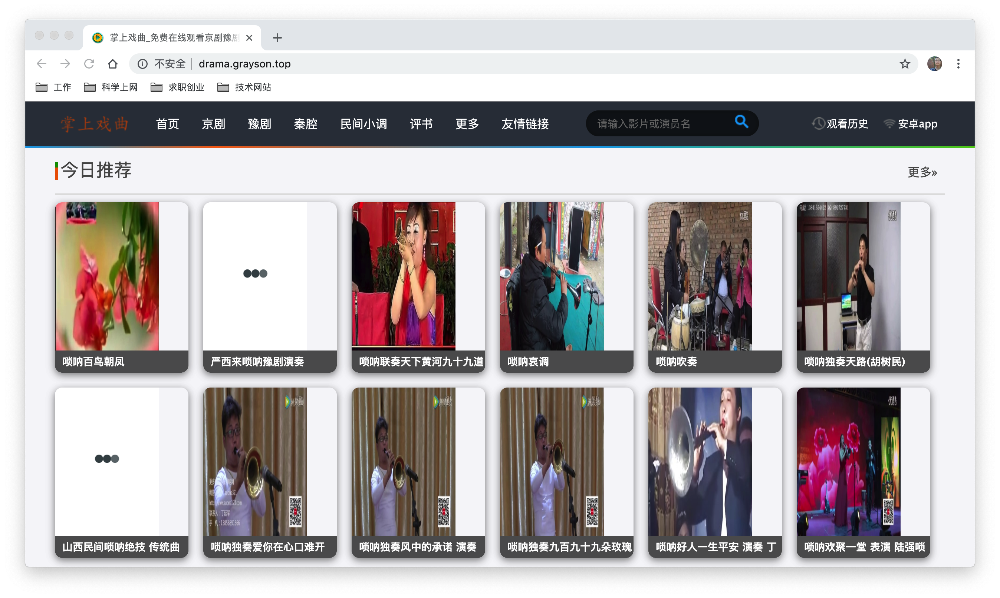
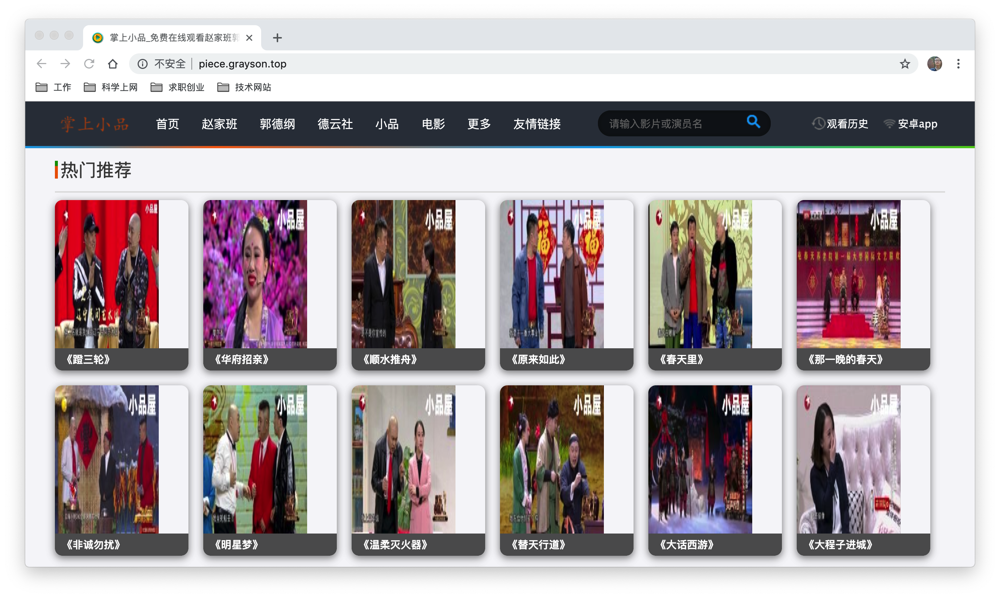

# 掌上影视

掌上影视是一个可以在线浏览最新影视资源的平台，分为PC端、移动端，同时包括一个爬虫工具，可以自动爬取不同影视平台上的数据，从而保证该平台可以拥有最新的资源。该平台主要提供电影、电视剧、电视直播、戏曲相关资源的浏览与播放。

掌上影视的PC端和移动端采用相同的接口来获取数据，接口主要使用```NodeJS```来编写，PC段主要使用```Html```、```Bootstrap```、```Jquery```来实现，移动端使用```Ionic```框架来实现，数据库采用```MongoDB```数据库。

> 本项目仅为学习之作，请勿用作商业用途，否则后果自负！

### 功能展示

#### Web端

<table>
  <tr><td ><center></center></td></tr>
  <tr><td ><center></center></td></tr>
  <tr><td ><center></center></td></tr>
  <tr><td ><center></center></td></tr>
  <tr><td ><center></center></td></tr>
</table>

#### 移动端

<table>
    <tr>
        <td ><center></center></td>
        <td ><center></center></td>
      <td ><center></center></td>
          </tr>
  <tr>
      <td ><center></center></td>
        <td ><center></center></td>
      <td ><center></center></td>
    </tr>
  <tr>
      <td ><center></center></td>
        <td ><center></center></td>
      <td ><center></center></td>
    </tr>
  <tr>
      <td ><center></center></td>
    </tr>
</table>

### 打赏

------

- 解决上面这些问题，需要花费很多时间与精力。支持项目继续完善下去，你也可以贡献一份力量！

- 有了打赏，也就会有更新的动力 : )

  

### 更新日志

------

#### v5.1.0 `2019/11/3`

- 爬虫：
  - 修改腾讯视频(```tencent```)、优酷视频(```youku```)、爱奇艺视频(```iqiyi```)爬虫逻辑，使数据爬取更为快速
  - `CommonUtils.py`新增方法：
    - ```reverse_type_name(type_name)```：转换影视资源类型名称，例如将1转换为01
    - ```get_year_from_name(name)```：从影视资源类型名称中获取年份
    - ```generate_app_qrcode_image()```：生成下载掌上影视APP二维码
- 备份数据库

#### v4.6.0 `2019/10/27`

- 爬虫：
  - 完善  ```start_spiders.sh```脚本逻辑，修复已经存在的问题
  - `CommonUtils.py`新增方法：
    - ```generate_qrcode_image(url)```：根据url生成二维码
- 移动端：
  - 影视模块中新增少儿版块
  - 页面布局重新优化
  - 修改视频解析接口，解决视频播放时有广告的问题
  - 视频播放时自动横屏
  - 新增搜索记录功能
  - 戏曲和小品模块中新增全部功能
- 备份数据库

#### v4.5.0 `2019/10/25`

- 爬虫：
  - 所有爬虫新增爬取最近数据功能，一部分爬取6页，一部分爬取2页
  - 对所有爬虫已经出现的问题进行修改
- 备份数据库

#### v4.4.0 `2019/10/24`

- 爬虫：
  - 对所有爬虫已经出现的问题进行修改
  - ```CommonUtils.py```中新增方法：
    - ```change_src_suffix(old_suffix, new_suffix)```：修改图片中的地址后缀
    - ```get_exclude_type2_list()```：获取排除在外的影视第二类型列表
    - ```modify_movie_type2(type2_list)```：修改影视第二类型
    - ```combine_movie()```：合并名称相同的影视
    - ```exclude_piece_type2(type2)```：判断小品类型是否在被排除的类型里面
    - ```reverse_update_time(update_time)```：转换更新日期
    - ```reverse_release_date(release_date)```：转换发布日期
    - ```delete_drama_with_url_invalid()```：删除不正确播放地址的戏曲视频
- 移动端：
  - 对页面布局进行调整
  - 新增搜索记录功能
- 备份数据库

#### v4.3.0 `2019/10/22`

- 移动端：
  - 新增播放页面，修改影视详情页面，将在影视详情页面播放改为在播放页面播放
  - 播放页面播放时自动横屏，可以在播放页面显示播放列表，不需要回到影视详情页面即可以更改影视资源
  - 搜索页面新增记录搜索记录功能
- 备份数据库

#### v4.2.0 `2019/10/19`

- 爬虫部分：
  - 新增相声小品网爬虫(```piece2```)，网址为：https://www.verity-china.com，主要爬取一些最新的相声小品
  - 新增永久资源网爬虫(```yongjiu```)，网址为：http://www.yongjiuzy.cc，主要爬取最新的影视数据
  - 新增135资源网爬虫(```zuiyuan135```)，网址为：[http://135zy0.com](http://135zy0.com)，主要爬取最新的影视数据
  - 新增ok资源网爬虫(```ok```)，网址为：http://www.okzy.co，主要爬取最新的影视数据
  - 新增33uu资源网爬虫(```ziyuan33uu```)，网址为：http://www.156zy.co，主要爬取最新的影视数据
- ```CommonUtils.py```中新增方法：
  - ```is_exclude_type2(type2)```：判断影视第二类型是否需要排除
  - ```is_need_source(item, collection)```：判断当前资源是否需要爬取
  - ```get_type_from_type2(type2)```：根据影视第二类型type2获取第一类型type
  - ```update_src_batch(old_suffix, new_suffix)```：批量修改电视中的图片地址
- 修复爬虫和网页中部分已知问题
- 备份数据库

#### v4.1.0 `2019/10/18`

- 爬虫部分：腾讯爬虫中新增少儿部分，新增优酷爬虫(```youku```)、爱奇艺(```iqiyi```)爬虫
- ```CommonUtils.py```中新增方法：
  - ```insert_item_to_dic(dic, key, new_key, new_value)```：向字典中添加新的元素
  - ```reverse_arr(arr)```：对数组中的元素去空格
- 修复爬虫中部分已知问题
- 备份数据库

#### v3.2.0 `2019/9/30`

- 爬虫部分增加了腾讯视频( ```tencent``` )，主要爬取电影、电视剧、综艺、动漫
- 电视爬虫接口改为好趣网([http://www.haoqu.net](http://www.haoqu.net/))
- 修复了爬虫部分的其他一些已知问题
- 新增掌上( ```Web``` )项目，包括掌上官网(http://www.grayson.top)、掌上影视(http://film.grayson.top)、掌上电视(http://tv.grayson.top)、掌上戏曲(http://drama.grayson.top)、掌上小品(http://piece.grayson.top)
- 备份数据库

#### v3.1.0 `2019/9/25`

- 移动版更换相关视频解析接口
- 移动版解决其它已知问题
- 新增爬取最大资源网(http://www.zuidazy1.net/)、酷云资源网 (http://www.kuyunzy1.com/)相关爬虫
- 备份数据库

#### v2.1.0 `2019/7/2`

- 移动版对影视、电视、戏曲、小品模块增加缓存功能
- 移动版解决其它已知问题
- 备份数据库

#### v1.10.0 `2019/7/1`

- 移动版修复刷新时推荐数据不能更新的问题
- 移动版解决其它已知问题

#### v1.9.0 `2019/7/1`

- 移动版在影视、电视、戏曲、小品模块增加猜你喜欢功能
- 移动版解决其它已知问题
- 改进爬虫代码、提升数据爬取效率
- 备份数据库

#### v1.8.0 `2019/6/30`

- 移动版修改接口地址
- 修复移动版其它已知问题
- 备份数据库

#### v1.7.0 `2019/6/28`

- 移动版新增双击退出功能
- 修复移动版其它已知问题
- 备份数据库

#### v1.6.0 `2019/6/28`

- 移动版新增小品模块
- 移动版实现浏览记录功能
- 解决移动版部分已知问题
- 爬虫新增小品模块
- 爬取小品数据
- 解决爬虫部分已知问题
- 接口新增获取所有小品数据、获取小品详情、获取小品类型、添加浏览记录、获取浏览记录接口
- 更新影视、电视、戏曲、小品数据
- 备份数据库

#### v1.5.0 `2019/6/9`

- 移动版功能完善
- 爬虫新增根据关键词爬取内容的功能
- 爬虫已知问题的修复
- 数据库的备份

#### v1.4.0 `2019/6/8`

- 移动版新增戏曲功能
- 修复戏曲爬虫问题
- 备份数据库

#### v1.3.0 `2019/6/6`

- 修复戏曲爬虫问题
- 新增戏曲类型爬虫
- 新增掌上影视小程序项目，并完成相应功能
- 备份数据库

#### v1.2.0 `2019/6/3`

- 增加戏曲爬虫
- 增加备份数据库脚本，并将数据库进行备份

#### v1.1.0 `2019/5/31`

- 修复影视爬虫爬取数据中影视名称、地区、简介为数组的问题
- 增加判断```python```类型的方法

#### v1.0.0 `2019/5/28`

- 完成影视接口代码的编写、测试及运行
- 完成移动端代码的编写、测试及运行
- 完成影视爬虫代码的编写、测试及运行

### 开发文档[待完善]

------

#### 接口代码(Web)使用方法

将```Web/PocketFilm/routers```下面的```api.js```中的```var dbURL = 'mongodb://localhost:27017';```中的```localhost```替换为数据库所在机器的域名或ip地址。

#### 移动端代码(Mobile)使用方法

将```Mobile/PocketFilm/src/app```下面的```config.service.ts```中的```public apiUrl = 'http://139.199.24.205:8080/api';```中的```139.199.24.205```替换为接口所在机器的域名或ip地址。

#### 爬虫代码(Spider)使用方法

1、将```Spider/PocketLifeSpider/PocketLifeSpider/util```下面的```MongoDbUtils.py```中的```139.199.24.205```环卫数据库所在机器的域名或ip地址。

```python
settings = {
    # "ip":'localhost',   #ip
    "ip":'139.199.24.205',   #ip
    "port":27017,           #端口
    "db_name" : "pocket_film",    #数据库名字
}
```

2、资源名称及其对应的命令

| 资源名称       | 命令                                  |
| -------------- | ------------------------------------- |
| 电影           | scrapy crawl movie -a target=1        |
| 电视剧         | scrapy crawl movie -a target=2        |
| 综艺           | scrapy crawl movie -a target=3        |
| 动漫           | scrapy crawl movie -a target=4        |
| 影视类型       | scrapy crawl movie_type               |
| 电影播放资源   | scrapy crawl movie_source -a target=1 |
| 电视剧播放资源 | scrapy crawl movie_source -a target=2 |
| 综艺播放资源   | scrapy crawl movie_source -a target=3 |
| 动漫播放资源   | scrapy crawl movie_source -a target=4 |
| 电视直播       | scrapy crawl tv                       |