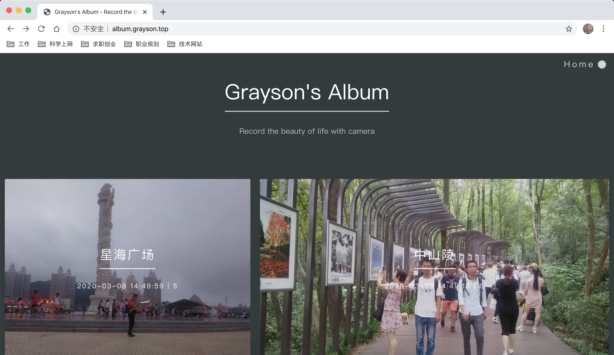

<p align='center'>
    <a href="https://github.com/ricear/PocketFilm/blob/master/LICENSE"></a>
    
    
    
    
    <a href="https://github.com/ricear/PocketFilm/pulls"></a>
    
    
    <a href="https://github.com/ricear/PocketFilm"></a>
    <a href="https://github.com/ricear/PocketFilm/releases"></a>
    <a href="https://github.com/ricear/PocketFilm"></a>
</p>
<p align='center'>
    <a href="https://ricear.com"></a>
    <a href="https://unsplash.com/@ricear"></a>
    <a href="https://twitter.com/ricear1996"></a>
</p>

##  简介

掌上影视是一个可以在线浏览最新影视资源的平台，分为PC端、移动端，同时包括一个爬虫工具，可以自动爬取不同影视平台上的数据，从而保证该平台可以拥有最新的资源。该平台主要提供电影、电视剧、电视直播、戏曲相关资源的浏览与播放。

掌上影视的PC端和移动端采用相同的接口来获取数据，接口主要使用```NodeJS```来编写，PC段主要使用```Html```、```Bootstrap```、```Jquery```来实现，移动端使用```Ionic```框架来实现，数据库采用```MongoDB```数据库。

> 本项目仅为学习之作，请勿用作商业用途，否则后果自负！

## 系统版本

* NodeJS：v10.16.3
* JDK：1.8.0
* MongoDB：v4.0.3
* Python：3.7.4
* Scrapy：1.6.0
* Nginx：1.17.0

## 部署方法

* 在你的服务器中建立文件夹`/usr/local/etc`，将`/usr/local/projects/PocketFilm/etc`下面的文件复制到`/usr/local/etc`下面，然后将`/usr/local/etc/nginx/nginx.conf`中的域名修改为你自己对应的域名
* 在你的服务器中建立文件夹`/usr/local/projects`
* 将`Server/PocketFilm`上传到你的服务器中的`/usr/local/projects`下面
* 进入到`/usr/local/projects/PocketFilm`中，以下操作均是相对于当前文件夹
* 进入到`files/shell`文件夹中
  * 启动`Nginx`：`sh start_nginx.sh `
  * 启动`MongoDB`：`nohup sh monitor.sh >/dev/null 2>nohup-monitor.out & `
  * 启动接口服务：`nohup sh start_api.sh >/dev/null 2>nohup-api.out &`
  * 启动掌上、掌上影视、掌上电视、掌上戏曲、掌上小品：`sh start_pocketfilm.sh`，如果启动单个或多个的话，其命令为`sh start_pocketfilm.sh movie,tv,drama`，不同的服务以逗号隔开，关闭相关服务的命令为`sh stop_pocketfilm.sh`，关闭单个或多个的命令为`sh stop_pocketfilm.sh movie,tv,drama`，不同的服务以逗号隔开
  * 启动推荐服务：`sh start_recommender.sh`
* 进入到`Spider/PocketLifeSpider/PocketLifeSpider/shell`文件夹中
  * 启动爬虫：
    * 爬取全部数据：`nohup sh start_spiders.sh all all >/dev/null 2>nohup-all-all.out & `
    * 爬取最近数据：`nohup sh start_spiders.sh all latest >/dev/null 2>nohup-all-latest.out & `
    * 参数说明：`sh start_spiders.sh all all`
      * 第一个`all`：爬虫类型，`all`表示全部爬虫，单个或多个爬虫以逗号分开，例如：`sh start_spiders.sh tencent,youku,iqiyi all`
      * 第二个`all`：表示全部数据，如果想爬取最近数据，则为`latest`，例如：`nohup sh start_spiders.sh all latest >/dev/null 2>nohup-all-latest.out & `

## 使用说明

* 项目分为接口服务、Web端、移动端、小程序、爬虫五个模块，不同模块使用不同的IDE导入相应的代码，具体如下：
  * 接口服务：文件夹为`Web/PocketFilm`
    * 使用`WebStorm`导入相应代码
    * 修改`Web/PocketFilm/routers/api.js`中的`var dbURL = 'mongodb://***:27017';`，将`***`修改为你自己服务器对应的ip
    * 修改`Web/PocketFilm/routers/api.js`中的`var avatarList`，将其中的默认图片修改为你自己的默认图片地址
  * Web端：文件夹为`WWW/PocketFilm`
    * 使用`Intellij IDEA`导入相应代码
    * 修改项目的Maven仓库地址
    * 修改`WWW/PocketFIlm/Common/src/main/java/com/grayson/common/config/Configs.java`中的`public static String API_HOST = "http://***:9000";`，将`***`修改为你自己服务器对应的ip，然后使用软件右侧的`MavenProjects`中的`Common`中的`Lifecycle->install`将其安装到你的Maven仓库中
  * 移动端：文件夹为`Mobile/PocketFilm`
    * 使用`Visual Studio Code`导入相应的代码
    * 修改`Mobile/PocketFilm/src/app/config.service.ts`中的`public sourceUrl = 'http://***:9000';`，将`***`修改为你自己服务器对应的ip
  * 小程序：文件夹为`Applet/PocketFilm`
    * 使用`微信web开发者工具`导入相应的代码
    * 修改`Applet/PocketFilm/utils/util.js`中的`const configUrl = 'http://***:9000';`，将`***`修改为你自己服务器对应的ip
  * 爬虫：文件夹为`Spider/PocketFilm`
    * 使用`PyCharm`导入相应的代码
    * 修改`Spider/PocketLifeSpider/PocketLifeSpider/util/MongoDbUtils.py`中的`"ip":'***'`，将`***`修改为你自己服务器对应的ip

## 功能展示

### Web端

<table>
  <tr><td ><center></center></td></tr>
  <tr><td ><center></center></td></tr>
  <tr><td ><center></center></td></tr>
  <tr><td ><center></center></td></tr>
  <tr><td ><center></center></td></tr>
  <tr><td ><center></center></td></tr>
</table>
### 移动端

<table>
    <tr>
        <td ><center></center></td>
        <td ><center></center></td>
      <td ><center></center></td>
          </tr>
  <tr>
      <td ><center></center></td>
        <td ><center></center></td>
      <td ><center></center></td>
    </tr>
  <tr>
      <td ><center></center></td>
        <td ><center></center></td>
      <td ><center></center></td>
    </tr>
  <tr>
      <td ><center></center></td>
    </tr>
</table>

## 打赏

------

- 解决上面这些问题，需要花费很多时间与精力。支持项目继续完善下去，你也可以贡献一份力量！

- 有了打赏，也就会有更新的动力 : )

  

## 更新日志

------

详见 [CHANGELOG](https://github.com/ricear/PocketFilm/blob/master/CHANGELOG.md)。

## 开发文档[待完善]

------

### 接口代码(Web)使用方法

将```Web/PocketFilm/routers```下面的```api.js```中的```var dbURL = 'mongodb://localhost:27017';```中的```localhost```替换为数据库所在机器的域名或ip地址。

### 移动端代码(Mobile)使用方法

将```Mobile/PocketFilm/src/app```下面的```config.service.ts```中的```public apiUrl = 'http://139.199.24.205:8080/api';```中的```139.199.24.205```替换为接口所在机器的域名或ip地址。

### 爬虫代码(Spider)使用方法

1、将```Spider/PocketLifeSpider/PocketLifeSpider/util```下面的```MongoDbUtils.py```中的```139.199.24.205```环卫数据库所在机器的域名或ip地址。

```python
settings = {
    # "ip":'localhost',   #ip
    "ip":'139.199.24.205',   #ip
    "port":27017,           #端口
    "db_name" : "pocket_film",    #数据库名字
}
```

2、资源名称及其对应的命令

| 资源名称       | 命令                                  |
| -------------- | ------------------------------------- |
| 电影           | scrapy crawl movie -a target=1        |
| 电视剧         | scrapy crawl movie -a target=2        |
| 综艺           | scrapy crawl movie -a target=3        |
| 动漫           | scrapy crawl movie -a target=4        |
| 影视类型       | scrapy crawl movie_type               |
| 电影播放资源   | scrapy crawl movie_source -a target=1 |
| 电视剧播放资源 | scrapy crawl movie_source -a target=2 |
| 综艺播放资源   | scrapy crawl movie_source -a target=3 |
| 动漫播放资源   | scrapy crawl movie_source -a target=4 |
| 电视直播       | scrapy crawl tv                       |
